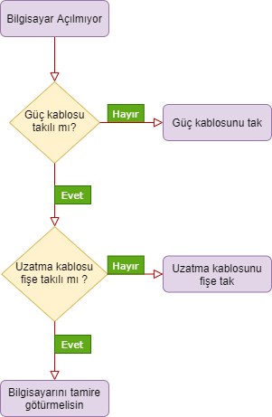

<!-- _backgroundColor: aquq -->

<!-- _color: green -->

<!-- paginate: false -->

## Sample Course Name

### Week-2 (Data Structures and Algorithms)

#### Spring Semester, 2022-2023

Download [DOC](week-2.en.md_doc.pdf), [SLIDE](week-2.en.md_slide.pdf), [PPTX](week-2.en.md_slide.pptx)

<iframe width=700, height=500 frameBorder=0 src="../week-2.en.md_slide.html"></iframe>

---

<!-- paginate: true -->

### Outline

- What is an Algorithm?
- Expression of Information on the Computer
- Arrays
- Linked-List

---

## **Algorithm**

---

### Algorithm

- **What is an Algorithm?**
  The algorithm emerged as a result of his research in the field of algebra in the 9th century by Harezmi, known as the ancestor and founder of algebra. Because the Europeans could not pronounce the name Khwarezmi, they used it as algorism (rules for solving arithmetic problems using Arabic numbers). The algorithm was later called "algorithm".
  

---

### Algorithm

- **What is an Algorithm?**
  As you can see, our main problem is that the computer does not work. The first step is to check if the power cord is plugged in. If the answer to this step is No, we need to plug in the power cable, the answer is Yes, and if our computer still does not work, we need to perform the next step. The second step, after examining the condition of the extension cable, concludes that if our computer still does not work, we need to take it for repair.

---

### Expression of Information on the Computer

- 
   When a person wants to express himself, he uses a native language, right? The computer also uses binary numbers (Binary Numbers) consisting of bits (0 and 1) to express information (Picture, sound, text, etc.) and to provide the loop.

---

### Expression of Information on the Computer

- 
   The numbers 1 and 0 (bits) in binary numbers indicate whether the transistors used by the computer for electrical transmission are on or off. Transistors have two commands, 0 (close) and 1 (open).

---

### Arrays

- 
   Arrays may need more than one object to make sense. For example, let's examine the computer example you are facing right now. Desktop computers make sense when they combine the keyboard-mouse-monitor trio. It is possible to make a trade without anyone, but it is difficult.
   Let's examine the memory problem, which is one of the array's drawbacks. Let's continue with our computer example. We already have a keyboard, a mouse and a monitor. When we get a new monitor we need a bigger desk. The same is true when we buy a new keyboard or mouse. We lose time and power while moving from one place to another.

---

### Arrays

- 

---

### Linked-List

- 
   Linked lists are structures that allow us to keep data without having to side by side. We do not need to open a new area in memory for the new element. Unlike Array, yes elements can be scattered in the memory, but the last element has to give its address to the previous element.
   
   

---

## References

- https://app.patika.dev/courses/veri-yapilari-ve-algoritmalar/algoritma-nedir
- https://app.patika.dev/courses/veri-yapilari-ve-algoritmalar/bilgi-ifade
- https://app.patika.dev/courses/veri-yapilari-ve-algoritmalar/sayi-sistem
- https://app.patika.dev/courses/veri-yapilari-ve-algoritmalar/linked-list

---

$End-Of-Week-2-Module$
